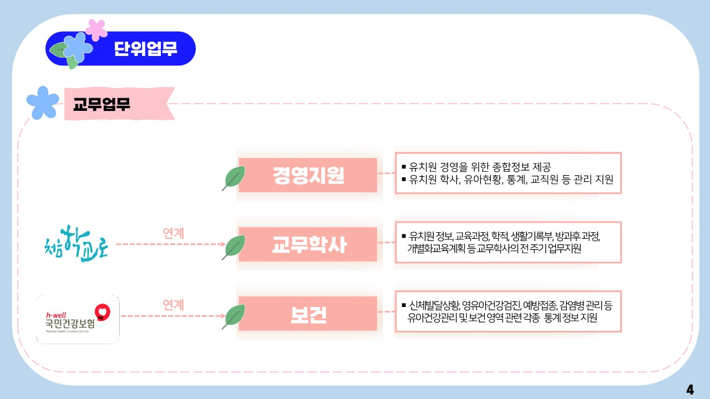

# Projects

<figure><figcaption></figcaption></figure>


**ood to know:** Splitting your product into fundamental concepts, objects, or areas can be a great way to let readers deep dive into the concepts that matter most to them.

